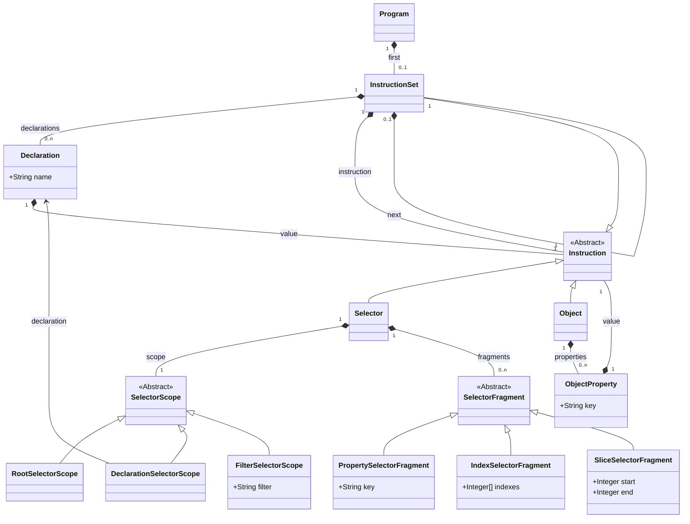

# Oui
L'objectif du cours DSL est de concevoir et implémenter un langage de programmation spécifique à un domaine, qui s'inscrit dans un scénario sur l'apprentissage automatique. Les trois domaines possibles sont :
- la transformation de données JSON en CSV,
- le traitement de données CSV,
- la définition de modèles d'apprentissage automatique.

L'implémentation doit compiler le langage créé en deux cibles d'exécutions différentes pour comparaison des performances.

Nous avons choisi la transformation de données JSON en CSV. Les deux cibles d'exécutions sont jq et Python. Jq est un utilitaire en ligne de commande spécialisé dans le traitement de données JSON. Sa syntaxe a servi d'inspiration première pour la nôtre, mais Oui, notre langage, se concentre uniquement sur la transformation des données, il ne supporte pas toutes les opérations proposées par jq. 

## Le langage
Un programme Oui est une suite d'instructions séparées par des pipes (`|`). Le programme doit contenir les instructions nécessaires pour transformer les données d'entrer en liste d'objets. Cette liste sera ensuite convertie en CSV, en utilisant le nom des propriétés du premier élément de la liste comme nom de colonnes et chaque objet comme ligne de données.

Exemple:
```json
[
  {
    "name": "John",
    "age": 30
  },
  {
    "name": "Jane",
    "age": 25
  }
]
```
```csv
name,age
John,30
Jane,25
```

> Si les données d'entrée ont déjà la forme nécessaire pour être converties en CSV, le programme Oui correspondant est donc vide, car aucune transformation n'est nécessaire.

### Instructions
Il existe plusieurs types d'instructions :
- les sélecteurs,
- les objets,
- les instructions imbriquées.

#### Sélecteurs
Un sélecteur permet de sélectionner une partie des données. On indique d'abords sur quelles données on souhaite travailler (le scope). On peut choisir de travailler sur les données d'entrée, sur une déclaration (voir plus bas) ou sur le résultat d'un filtre, sorte de fonction arbitraire. Ensuite, on indique les propriétés ou les index que l'on souhaite sélectionner. On peut aussi utiliser des slices pour sélectionner des intervalles de données. On peut combiner plusieurs sélecteurs (appelés fragments) pour sélectionner des données plus complexes et éviter d'avoir à écrire plusieurs instructions.

> Les exemples de cette partie ne sont pas des programmes Oui valides, car les données qu'ils retournent ne sont pas des listes d'objets. Ils sont donnés à titre d'exemple pour illustrer le fonctionnement des sélecteurs individuellement.

Exemples:
- Sélectionner la propriété `name` de l'objet d'entrée :
```json
{
  "name": "John",
  "age": 30
}
```
```oui
$.name
```
```json
"John"
```
- Enchainer les fragments de sélecteurs :
```json
{
  "name": "John",
  "age": 30,
  "address": {
    "street": "Main Street",
    "number": 42
  }
}
```
```oui
$.address.street
```
```json
"Main Street"
```
- Sélectionner un intervalle de données :
```json
{
  "name": "John",
  "age": 30,
  "friends": [
    "Jane",
    "Bob",
    "Alice"
  ]
}
```
```oui
$.friends[1:3]
```
```json
[
  "Bob",
  "Alice"
]
```
Ce dernier exemple montre que les sélecteurs peuvent être utilisés pour sélectionner plusieurs données. Dans ce cas, toutes les instructions qui suivent le sélecteur seront **appliquées à chaque élément** sélectionné.

#### Filtres
Les filtres sont des fonctions qui font des transformations spéciales sur les données. Un exemple typique est le filtre `keys`, qui retourne les clés d'un objet. Oui laisse la liberté à l'utilisateur d'ajouter ses propres filtres, soit au niveau du compilateur comme une sorte de raccourci de syntaxe, ou au niveau des cibles (plutôt Python puisque jq n'est pas extensible) comme des fonctions natives.
À l'heure actuelle, le compilateur jq supporte les filtres `keys`, `values`, `entries` et `length`. Le compilateur Python permet d'utiliser n'importe quelle fonction Python (voir le détail de l'implémentation Python pour plus d'information).

Exemples:
- Utiliser un filtre:
```json
{
  "name": "John",
  "age": 30,
  "address": {
    "street": "Main Street",
    "number": 42
  }
}
```
```oui
keys
```
```json
[
  "name",
  "age",
  "address"
]
```
- Utiliser un filtre avec un sélecteur :
```json
{
  "name": "John",
  "age": 30,
  "address": {
    "street": "Main Street",
    "number": 42
  }
}
```
```oui
$.address | entries
```
```json
[
  {
    "key": "street",
    "value": "Main Street"
  },
  {
    "key": "number",
    "value": 42
  }
]
```

> Contrairement aux autres exemples, celui ci-dessus est un programme Oui valide. Le CSV généré aurait deux colonnes `key` et `value` et deux lignes de données.

#### Objets
Les objets sont des instructions qui permettent de créer des objets JSON. Ils sont composés d'une liste de propriétés, chacune étant composée d'un nom et d'une valeur, qui peut être n'importe quelle instruction. Les objets peuvent être imbriqués.

Exemples:
- Créer un objet simple :
```json
{
  "name": "John",
  "age": 30,
  "address": {
    "street": "Main Street",
    "number": 42
  }
}
```
```oui
{ name: $.name, street: $.address.street }
```
```json
[
  {
    "name": "John",
    "street": "Main Street"
  }
]
```
- Créer plusieurs objets avec un sélecteur d'indices :
```json
{
  "name": "John",
  "age": 30,
  "friends": [
    {
      "name": "Jane",
      "age": 28
    },
    {
      "name": "Bob",
      "age": 32
    },
    {
      "name": "Alice",
      "age": 25
    }
  ]
}
```
```oui
{ name: $.name, friend: $.friends[].name }
```
```json
[
  {
    "name": "John",
    "friend": "Jane"
  },
  {
    "name": "John",
    "friend": "Bob"
  },
  {
    "name": "John",
    "friend": "Alice"
  }
]
```

#### Instructions imbriquées
Les instructions peuvent être imbriquées. Cette fonctionnalité est surtout utile pour la définition de la valeur d'une propriété d'un objet ou d'une déclaration.

Exemples:
- Calculer le nombre d'amis d'une personne :
```json
{
  "name": "John",
  "age": 30,
  "friends": [
    {
      "name": "Jane",
      "age": 28
    },
    {
      "name": "Bob",
      "age": 32
    },
    {
      "name": "Alice",
      "age": 25
    }
  ]
}
```
```oui
{ name: $.name, friends: ($.friends | length) }
```
```json
{
  "name": "John",
  "friends": 3
}
```

### Déclarations
Les déclarations permettent de stocker un résultat intermédiaire dans une variable. Elles sont composées d'un nom et d'une valeur, qui peut être n'importe quelle instruction. Elles peuvent être placées avant chaque instruction, et sont valables pour toutes les instructions qui suivent (imbriquées ou non).
Si l'instruction qui détermine la valeur retourne plusieurs résultats, toutes les instructions suivantes seront exécutées pour chaque résultat, de la même manière que pour les instructions classiques.

Exemples:
- Utiliser une déclaration :
```json
{
  "name": "John",
  "age": 30,
  "address": {
    "street": "Main Street",
    "number": 42
  }
}
```
```oui
name = $.name; $.address | { name: $name, street: $.street }
```
```json
{
  "name": "John",
  "street": "Main Street"
}
```

### Diagramme de classe du langage Oui



## Implémentation
Oui est implémenté par ce projet Gradle, dont voici la structure :
```
./
├─ benchmark/ .......................... Dossier contenant les sources et configurations des tests de performance
├─ io.basicbich.oui/src/
│  ├─ main/
│  │  ├─ java/io/basicbich/oui/
│  │  │  ├─ compiler/
│  │  │  │  ├─ exception/ .............. Exceptions des compilateurs
│  │  │  │  ├─ jq/
│  │  │  │  │  └─ ProgramCompiler.java . Compilateur jq
│  │  │  │  ├─ python/
│  │  │  │  │  └─ ProgramCompiler.java . Compilateur python
│  │  │  │  ├─ AlternativeMapper.java .. Utilitaire pour les alternatives dans la grammaire Xtext
│  │  │  │  ├─ Common.java ............. Code commun aux compilateurs
│  │  │  │  └─ Compiler.java ........... Interface commune aux compilateurs
│  │  │  ├─ validation/
│  │  │  │  └─ OuiValidator.java ....... Validateur Xtext
│  │  │  ├─ Oui.xtext .................. Grammaire Xtext
│  │  │  └─ ProgramParser.java ......... Parseur de programmes Oui
│  │  └─ resources/
│  │     ├─ epilog.py .................. Code Python statique ajouté à la fin du programme compilé
│  │     └─ prolog.py .................. Code Python statique ajouté au début du programme compilé
│  └─ test/java/io/basicbich/oui/tests/
│     ├─ BenchmarkTest.java ............ Tests de performance
│     └─ OuiParsingTest ................ Tests de parsing
└─ Dockerfile .......................... Fichier de configuration du conteneur Docker
```

### Compilateur jq
Le langage de jq étant très proche de Oui, le compilateur jq est très simple, chaque expression a un équivalent direct dans jq. Il est ajouté à chaque programme un épilogue qui contient les instructions jq pour transformer la liste d'objet en fichier CSV.

### Compilateur Python
Le compilateur Python est plus complexe, car il doit gérer les déclarations et les instructions imbriquées. Les programmes compilés sont en réalité une représentation de l'arbre de syntaxe abstraite du programme Oui, où chaque type d'expression à une classe Python correspondante qui peut évaluer son résultat et ses expressions enfants. L'interprétation du programme s'effectue donc à l'exécution uniquement, le compilateur en lui-même ne fait qu'une conversion de l'arbre de syntaxe abstraite en code Python, le code d'exécution étant statique.

## Mesures de performance
La mesure de performance est effectuée par la fabrique de tests `BenchmarkTest.java`. Cette fabrique génère un ensemble de tests en fonction des fichiers du dossier `benchmark` à la racine du projet, permettant une grande flexibilité dans la définition des tests sans avoir à écrire du code.

Les tests sont identifiés par un nom de fichier, qui doit être unique. Un fichier `.oui` doit être présent pour considérer l'ensemble des fichiers ayant le même nom comme un test.

Chaque test à trois sous-tests :
- test de compilation : le fichier `.oui` est parsé et validé, puis compilé en Python et jq. Si des fichiers `.py` ou `.jq` sont présents, ils sont comparés au code compilé.
- test d'exécution : le programme compilé est exécuté si des données d'entrée peuvent être déterminées soit par un fichier `.json` simple, soit par un fichier `.schema.json`, qui sera utilisé pour générer des données automatiquement. Si un fichier `.csv` est présent, il est comparé au résultat de l'exécution, sinon les résultats des deux exécutions sont comparés.
- test de performance : le programme compilé est exécuté plusieurs fois en mesurant le temps d'exécution et l'utilisation mémoire, selon les paramètres du fichier `evaluation-options.csv`, qui contrôle la taille des données générées dans le cas d'un fichier `.schema.json`, ainsi que le nombre de répétitions. Les résultats sont enregistrés dans le fichier `evaluation-results.csv` qui peut être utilisé pour générer des graphiques.

Cinq programmes types sont présents dans le dossier `benchmark`, accompagnés de leur équivalent en jq et du schéma de données pour la génération automatique. Les tests peuvent être lancés avec Docker avec les deux commandes suivantes :
```bash
$ docker build -t oui .
$ docker run --rm -v "$PWD":/home/gradle/src oui
```
