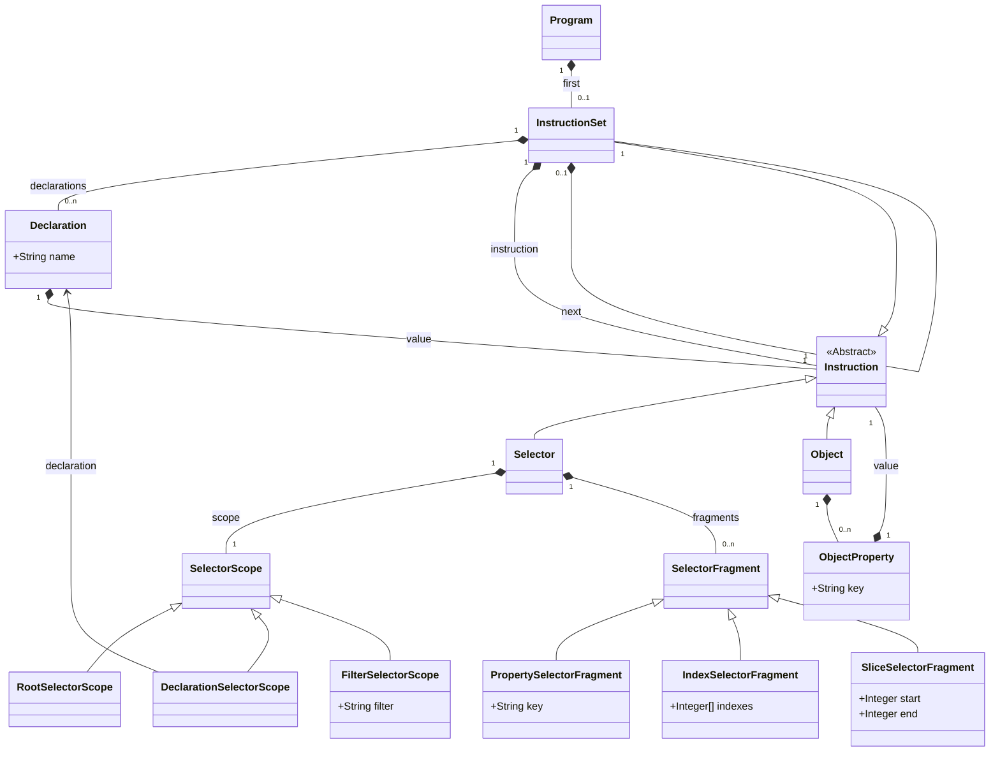

# Oui


```mermaid
classDiagram
    Program "1" *-- "0..1" InstructionSet: first

    InstructionSet "1" *-- "0..n" Declaration: declarations
    InstructionSet "1" *-- "1" Instruction: instruction
    InstructionSet "0..1" *-- "1" InstructionSet: next

    Declaration : +String name
    Declaration "1" *-- "1" Instruction: value

    Instruction <|-- InstructionSet
    Instruction <|-- Selector
    Instruction <|-- Object
    <<Abstract>> Instruction

    Selector "1" *-- "1" SelectorScope: scope
    Selector "1" *-- "0..n" SelectorFragment: fragments

    SelectorScope <|-- RootSelectorScope
    SelectorScope <|-- DeclarationSelectorScope
    SelectorScope <|-- FilterSelectorScope
    DeclarationSelectorScope --> Declaration: declaration
    FilterSelectorScope : +String filter
    
    SelectorFragment <|-- PropertySelectorFragment
    SelectorFragment <|-- IndexSelectorFragment
    SelectorFragment <|-- SliceSelectorFragment

    PropertySelectorFragment: +String key
    IndexSelectorFragment: +Integer[] indexes
    SliceSelectorFragment: +Integer start
    SliceSelectorFragment: +Integer end

    Object "1" *-- "0..n" ObjectProperty
    ObjectProperty: +String key
    ObjectProperty "1" *-- "1" Instruction: value
```

```bash
$ docker build -t oui .
$ docker run --rm -v "$PWD":/home/gradle/src oui
```
