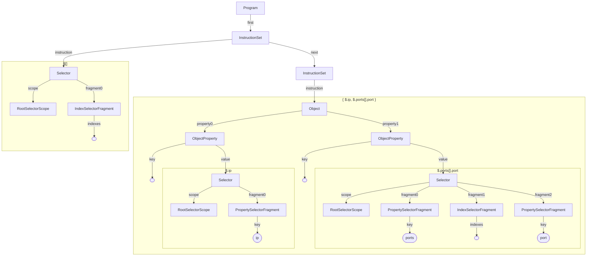

# Benchmark

## Empty program
Input:
```json
[
  {"name": "John", "age": 42},
  {"name": "Jane", "age": 38},
  {"name": "Bob", "age": 12},
  {"name": "Dylan", "age": 21}
]
```
Output:
```csv
"name","age"
"John",42
"Jane",38
"Bob",12
"Dylan",21
```

Oui program:
```

```

Model:


## Object repetition
Input:
```json
[
  {"ip": "195.66.2.37", "ports": [ {"port": 0}, {"port": 80}, {"port": 443} ]},
  {"ip": "145.38.39.15", "ports": [ {"port": 0} ]},
  {"ip": "87.116.6.182", "ports": [ {"port": 0}, {"port": 22} ]}
]
```
Output:
```csv
"ip","port"
"195.66.2.37",0
"195.66.2.37",80
"195.66.2.37",443
"145.38.39.15",0
"87.116.6.182",0
"87.116.6.182",22
```

Oui program:
```
$[] | { $.ip, $.ports[].port }
```
Model:

## Cartesian product
Input:
```json
{
  "colors": [
    "red",
    "blue"
  ],
  "cars": [
    "Ford",
    "BMW"
  ]
}
```
Output:
```csv
"color","car"
"red","Ford"
"red","BMW"
"blue","Ford"
"blue","BMW"
```

Oui program:
```
{ color: $.colors[], car: $.cars[] }
```
Model:


## Matrix extraction
Input:
```json
[
  [ {"x": 0, "y": 0}, {"x": 1, "y": 0}, {"x": 2, "y": 0} ],
  [ {"x": 0, "y": 1}, {"x": 1, "y": 1}, {"x": 2, "y": 1} ],
  [ {"x": 0, "y": 2}, {"x": 1, "y": 2}, {"x": 2, "y": 2} ]
]

```
Output:
```csv
"x","y"
0,0
1,0
2,0
0,1
1,1
1,1
0,2
1,2
2,2
```

Oui program:
```
$[][]
```
Model:


## Large program
Input:
```json
{
  "quiz": {
    "sport": {
      "q1": {
        "question": "Which one is correct team name in NBA?",
        "options": [
          "New York Bulls",
          "Los Angeles Kings",
          "Golden State Warriros",
          "Huston Rocket"
        ],
        "answer": "Huston Rocket"
      }
    }
  }
}
```
Output:
```csv
"id","category","question"
"q1","sport","Which one is correct team name in NBA?"
```

Oui program:
```
$.quiz | entries | category=$.key; $.value | entries | {id: $.key, $category, $.value.question}
```
Model:

